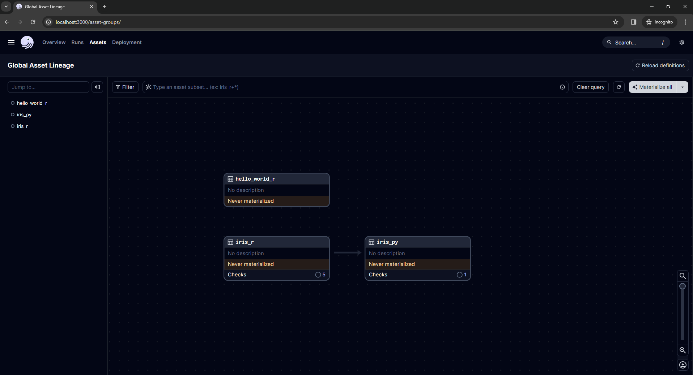
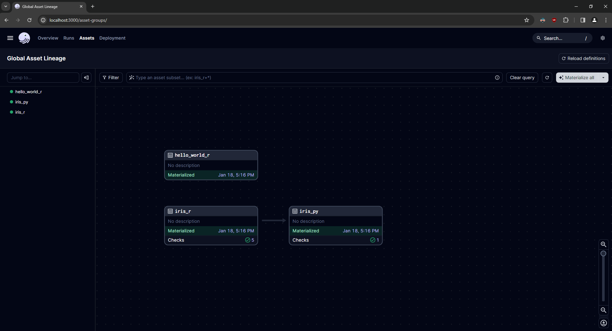
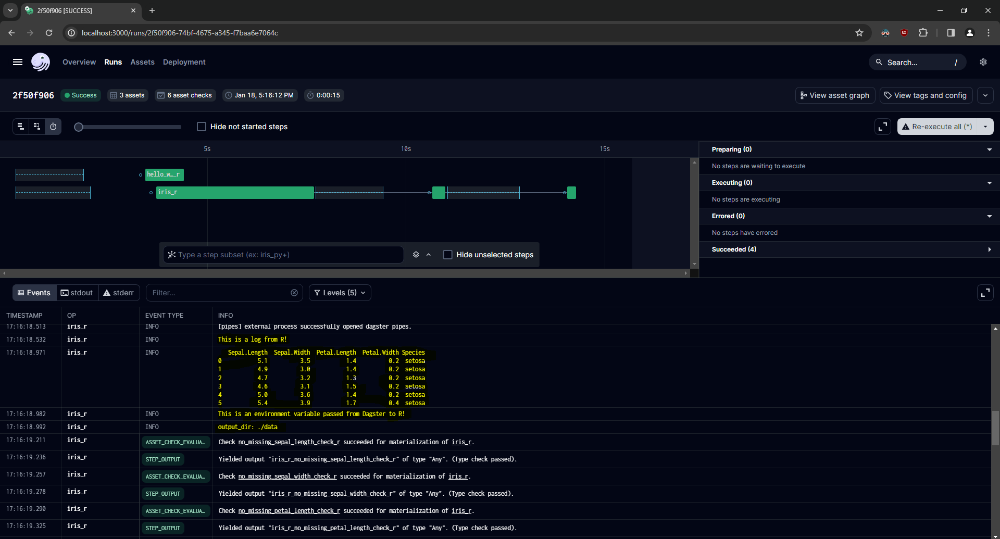

# dagster_and_r

Exploring the synergy between [Dagster](https://dagster.io/), a modern data orchestrator, and R, a powerful statistical programming language. This project showcases how business logic written in R can be integrated seamlessly within the Dagster framework. 

## Key Features

- **Docker Integration**: Execute R code in isolated environments using [Docker container ops](https://docs.dagster.io/_apidocs/libraries/dagster-docker).
- **Dagster Pipes**: Run R scripts within a subprocess, leveraging Dagster's experimental [Pipes](https://docs.dagster.io/_apidocs/pipes#pipes) feature.
- **Reticulate Bridge**: Utilize the [{reticulate}](https://rstudio.github.io/reticulate/) R package to create a bridge between Python and R, enhancing interoperability.

## Getting started

To begin exploring the integration of Dagster and R:

1. **Clone the Repository**
   ```bash
   git clone https://github.com/philiporlando/dagster-and-r.git
   ```
2. **Navigate to Directory**
   ```bash
   cd dagster-and-r
   ```
3. **Install Dependencies**
   Using [poetry](https://python-poetry.org/), install the package and its dependencies:
   ```bash
   poetry install
   ```

4. **Launch the Dagster UI**
   Start the Dagster web server:
   ```bash
   poetry run dagster dev
   ```
   Access the UI at http://localhost:3000 in your browser.



5. **Materialize Assets** 
   Click the "Materialize all" button in the top right of the UI. Each of the assets within this project should materialize without error. 

   

6. **Inspect the Run**
   Click the "Runs" tab and navigate to the latest run of the pipeline to view more details. This includes custom logs executed from within the external R code, environment variables, etc. 

   

7. **Create Assets**
   Begin writing assets in `dagster_and_r/assets.py`. They are automatically loaded into the Dagster code location.


Then, start the Dagster UI web server:

```bash
poetry run dagster dev -m dagster_and_r
```

Open http://localhost:3000 with your browser to see the project.

You can start writing assets in `dagster_and_r/assets.py`. The assets are automatically loaded into the Dagster code location as you define them.

## Current Integrations

### Dagster Pipes

- [x] Pass logs between an external R session and Dagster
- [x] Pass environment variables and context between an external R session and Dagster
- [x] Asset checks defined in R
- [ ] [In-memory data passing](https://github.com/dagster-io/dagster/discussions/18972#discussioncomment-8113649) 
- [ ] Pass markdown metadata between R and Dagster (e.g. `head()` of a data.frame))

### Docker Container Op

- [x] Execute external R code from a Docker container op. 

## Development Guide

### Adding Python Dependencies
To add new Python packages to the project:
```bash
poetry add <pkg-name>
```

### Unit Testing
Unit tests are essential for ensuring code reliability and are currently being developed. Run existing tests using `pytest`:
```bash
poetry run pytest dagster_and_r_tests
```
> [!NOTE]
> Unit tests are a work in progress.

### Schedules and Sensors
To enable [Schedules](https://docs.dagster.io/concepts/partitions-schedules-sensors/schedules) and [Sensors](https://docs.dagster.io/concepts/partitions-schedules-sensors/sensors), ensure the [Dagster Daemon](https://docs.dagster.io/deployment/dagster-daemon) is active:
```bash
poetry run dagster dev
```
With the Daemon running, you can start using schedules and sensors for your jobs.

## Contributions
Contributions to enhance or expand the project are welcome! Feel free to fork the repository, make changes, and submit a pull request.
